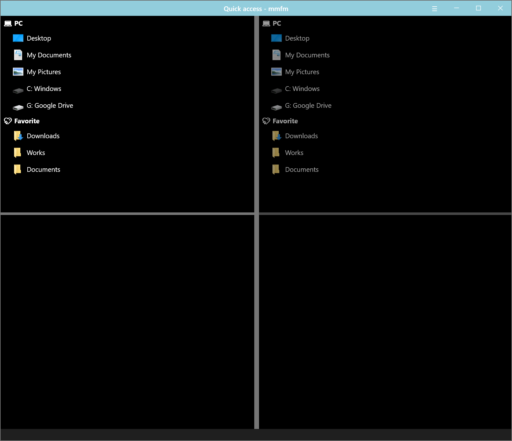
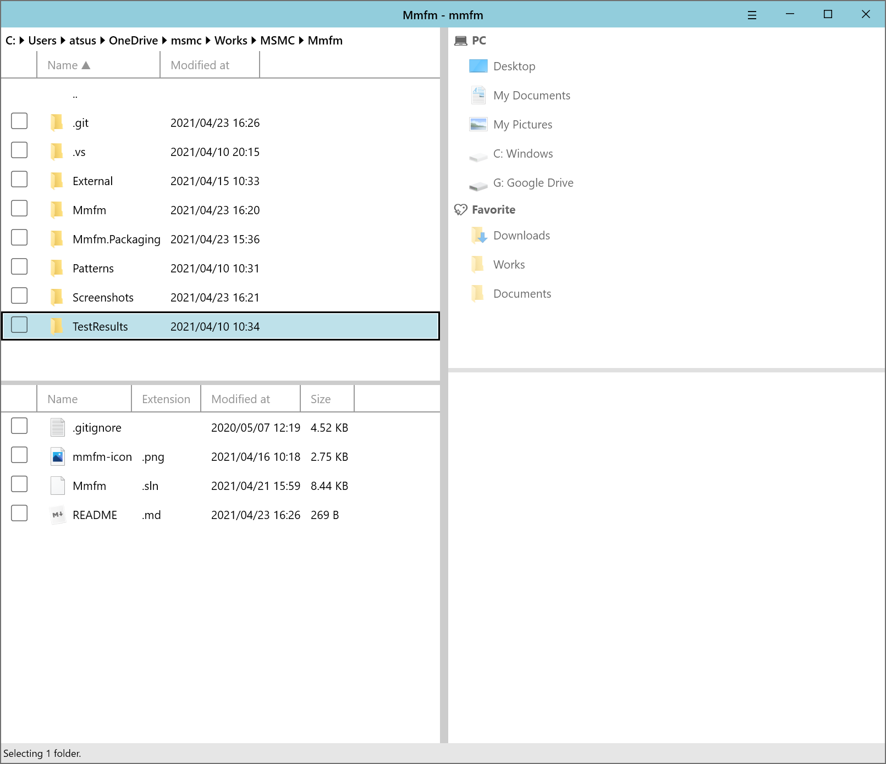

## What is mmfm?

mmfm is a modern Dual-Pane File Manager App for Windows 10.

 



## Features

- Keyboard oriented operation
  - Hot-key activation
  - Command(like Visual Studio Code / Windows Terminal)
- Customizable
  - Font family and size
  - Hot-key definition
  - Theme(light or dark) / Accent color
  - Key binding
- Extensible
  - User-defined commands 

## User-defined commands

### Tree commands

You can tree commands by name with character `/`.

If you want to build tree like:

```
A
├─ B
│  └─ C
└─ D
```

Define commands with name:

- A/B/C

- A/D

### Environment variables

| Variable name | Description                                     |
| ------------- | ----------------------------------------------- |
| %fullpath%    | The path of directory currently active.         |
| %selected%    | The paths of selected items separeted by space. |

### Recommended commands

#### Tortoise git

commit

```
"C:\Program Files\TortoiseGit\bin\TortoiseGitProc.exe" /command:commit /path:%fullpath%
```

other commands, please see:

[Appendix D. Automating TortoiseGit – TortoiseGit – Documentation – TortoiseGit – Windows Shell Interface to Git](https://tortoisegit.org/docs/tortoisegit/tgit-automation.html)

#### Open with apps

Open in Windows Terminal

```
wt new-tab -d %fullpath%
```

Open in Visual Studio Code

```
code %selected%
```

Open in Windows Explorer

```
explorer %fullpath%
```


## QuickLook Integration

mmfm supports [QuickLook](https://github.com/QL-Win/QuickLook).  Install QuickLook and launch, you can preview file selected in mmfm. Default key-binding is `Alt+Q`. You can modify key-binding in Settings.


## Privacy Policy

mmfm and MARSHMALLOW MACHINE Inc. do not store any personal information, keyboard typing.

We physically can’t.  We have nowhere to store it.  We don’t even have a server database to store it. 
